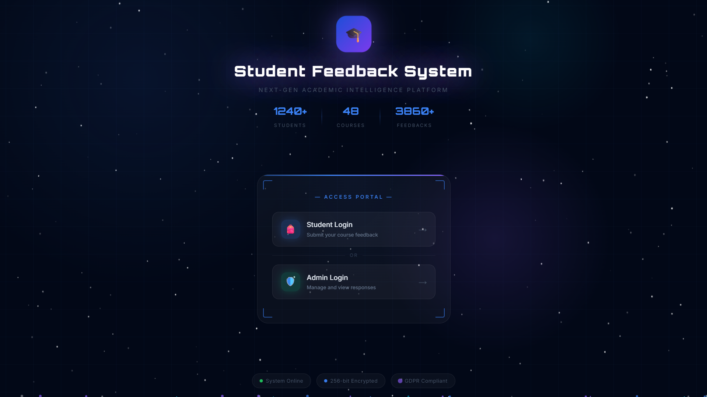
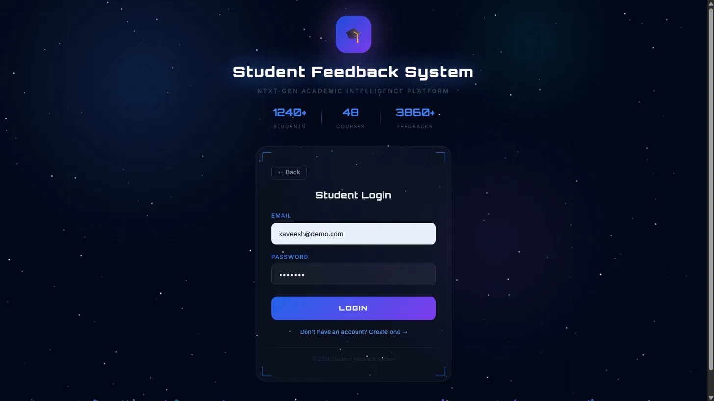
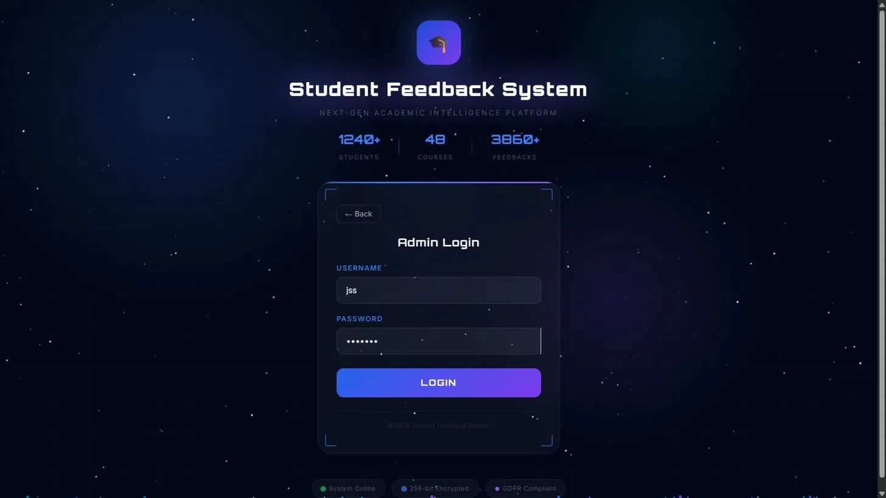
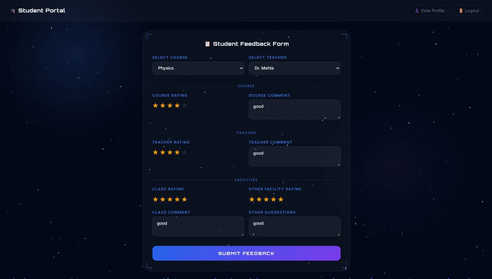
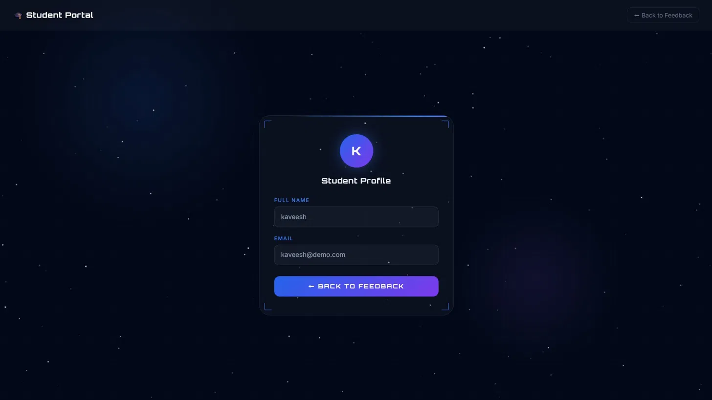
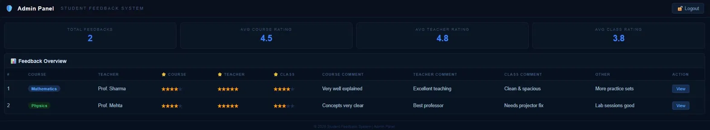

<!-- ========================================= -->
<!-- HERO SECTION -->
<!-- ========================================= -->

<p align="center">
  
</p>

<h1 align="center">🎓 Student Feedback System</h1>

<p align="center">
  
</p>

<p align="center">
Transforming Educational Feedback Through Analytics & Automation
</p>

<p align="center">


</p>

---

# 🚀 Project Overview

Student Feedback System is a modern full-stack academic feedback platform designed to simplify the collection, management, and analysis of student feedback.

The platform enables students to submit course and faculty reviews while providing administrators with real-time analytics and actionable insights.

Built using Angular 19, Spring Boot, PostgreSQL, and JWT Authentication, the system delivers secure, scalable, and efficient feedback management for educational institutions.

---

# ✨ Key Features

<table>
<tr>
<td width="50%">

### 👨‍🎓 Student Portal

Submit and manage academic feedback.

</td>

<td width="50%">

### 🔒 JWT Authentication

Secure login and authorization system.

</td>
</tr>

<tr>
<td>

### 📊 Analytics Dashboard

Real-time reports and feedback insights.

</td>

<td>

### 👨‍💼 Admin Management

Manage students, faculty, and feedback.

</td>
</tr>

<tr>
<td>

### 🛡️ Role-Based Access

Student, Faculty & Admin roles.

</td>

<td>

### 📱 Responsive UI

Works on desktop, tablet, and mobile.

</td>
</tr>
</table>

---

# 📈 Business Impact

| Metric | Result |
|----------|----------|
| Authentication | JWT Secured |
| Database Design | 6 Normalized Tables |
| API Response Time | < 200ms |
| Concurrent Users | 100+ |
| Dashboard Analytics | Real-Time |
| Scalability | Enterprise Ready |

---

# 🖼️ Product Screenshots

## 🌟 Landing Page



---

## 👨‍🎓 Student Login



---

## 👨‍💼 Admin Login



---

## 📝 Feedback Form



---

## 👤 Student Profile



---

## 📊 Admin Dashboard



---

# 🏗️ 3D System Architecture

```text
                    🎓 STUDENT

                         │
                         ▼

             ┌───────────────────────┐
             │   Angular Frontend    │
             └───────────┬───────────┘
                         │
                         ▼

             ┌───────────────────────┐
             │ Spring Boot REST APIs │
             └───────────┬───────────┘
                         │

     ┌───────────────────┼───────────────────┐
     │                   │                   │

     ▼                   ▼                   ▼

┌───────────┐     ┌─────────────┐     ┌────────────┐
│PostgreSQL │     │ JWT Security│     │ Analytics  │
│ Database  │     │ & Auth      │     │ Dashboard  │
└───────────┘     └─────────────┘     └────────────┘

     │                   │                   │

     └───────────────────┼───────────────────┘
                         │

                         ▼

              👨‍💼 ADMIN DASHBOARD
```

---

# ⚡ Core Modules

## 👨‍🎓 Student Module

- Submit Feedback
- View Submitted Feedback
- Manage Profile
- Course Feedback System

---

## 👨‍🏫 Faculty Module

- View Ratings
- Performance Insights
- Feedback Analytics

---

## 👨‍💼 Admin Module

- User Management
- Course Management
- Feedback Monitoring
- Analytics Dashboard

---

## 📊 Analytics Module

- Real-Time Statistics
- Faculty Performance Analysis
- Course Evaluation Reports
- Student Engagement Metrics

---

## 🔐 Authentication Module

- JWT Login
- Protected Routes
- Role-Based Authorization
- Session Security

---

# 📂 Project Structure

```text
src/
├── app/
│
├── components/
│   ├── admin-dashboard/
│   ├── feedback-form/
│   ├── login/
│   ├── signup/
│   └── profile/
│
├── guards/
│
├── services/
│
├── models/
│
├── app-routing.module.ts
│
└── index.html
```

---

# 🚀 Run Locally

## Frontend

```bash
npm install

ng serve
```

Application runs at:

```text
http://localhost:4200
```

---

## Backend

```bash
mvn spring-boot:run
```

---

# 🔑 Features

✅ Student Feedback Submission

✅ Faculty Evaluation System

✅ JWT Authentication

✅ Role-Based Access Control

✅ PostgreSQL Integration

✅ REST APIs

✅ Analytics Dashboard

✅ Secure Session Management

✅ Responsive User Interface

---

# 📚 Learning Outcomes

This project helped in understanding:

- Angular Development
- Spring Boot Backend Development
- PostgreSQL Database Design
- JWT Authentication
- REST API Development
- Role-Based Access Control
- Full Stack Integration
- Dashboard Design
- Data Analytics
- Software Architecture

---

# 🔒 Security Features

✅ JWT Authentication

✅ Protected API Routes

✅ Secure Password Storage

✅ Session Management

✅ Role-Based Authorization

✅ Input Validation

---

# 🛠️ Tech Stack

## Frontend

- Angular 19
- TypeScript
- RxJS
- Bootstrap 5

## Backend

- Spring Boot
- REST APIs
- JWT Authentication

## Database

- PostgreSQL
- pgAdmin4

## Tools

- Maven
- Git
- GitHub
- IntelliJ IDEA

---

# 🔮 Future Enhancements

- 📧 Email Notifications
- 📄 PDF Report Generation
- 📊 Advanced Analytics Dashboard
- ☁️ AWS Deployment
- 🔐 OAuth & Google Login
- 📱 Mobile Application
- 🤖 AI-Based Feedback Analysis

---

# 👨‍💻 Developer

## Kaveesh Dhiman

💻 Full Stack Developer

🏢 Ex-Intern @ National Informatics Centre (NIC), Government of India

🎓 B.Tech CSE — Dronacharya College of Engineering

📧 kaveesh9876@gmail.com

🔗 GitHub: https://github.com/kaveesh9876-png

🔗 LinkedIn: https://www.linkedin.com/in/kaveesh-dhiman-4b619b322

---

# 📄 License

This project is developed for educational, portfolio, and research purposes.

---

<p align="center">
⭐ If you found this project useful, consider giving it a star.
</p>

<p align="center">
  
</p>
